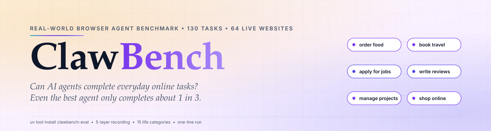
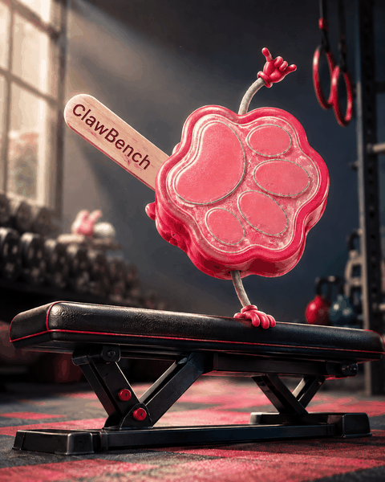
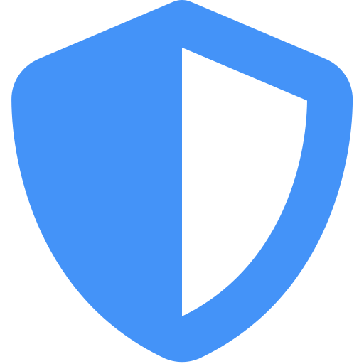
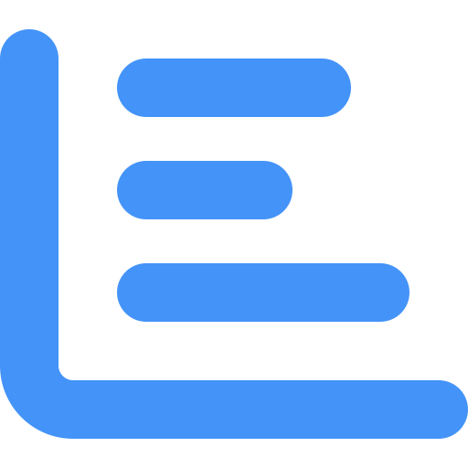

<div align="center">

<a href="https://github.com/TIGER-AI-Lab/ClawBench">
  <picture>
    <source media="(prefers-color-scheme: dark)" srcset="../assets/hero-dark.svg">
    
  </picture>
</a>

[](https://arxiv.org/abs/2604.08523)
[](https://huggingface.co/spaces/TIGER-Lab/ClawBench)
[](https://huggingface.co/datasets/NAIL-Group/ClawBench)
[](https://huggingface.co/datasets/TIGER-Lab/ClawBenchV2Trace)
[](https://claw-bench.com)
[](https://pypi.org/project/clawbench-eval/)
[](https://github.com/TIGER-AI-Lab/ClawBench/issues/new/choose)
[](https://github.com/TIGER-AI-Lab/ClawBench)
[](https://github.com/TIGER-AI-Lab/ClawBench/blob/main/LICENSE)

<a href="https://huggingface.co/papers/2604.08523"></a>
<a href="https://deepwiki.com/TIGER-AI-Lab/ClawBench"></a>

</div>

# ClawBench：AI 智能体能完成日常在线任务吗？

<div align="center">

**ClawBench 是一个开源基准，用于评测 AI browser agent 在日常在线任务上的表现 —— 订酒店、点外卖、投简历、管理邮件 —— 全部在真实网站上进行。V1 位于 `test-cases/v1/`，V2 位于 `test-cases/v2/`。它通过 5 层录制管线和对照人工参考轨迹的 agentic evaluator 衡量端到端任务完成率。按语料、harness 和评分规则划分的结果请见[实时榜单](https://huggingface.co/spaces/TIGER-Lab/ClawBench)。**



我们让前沿 AI 智能体去做人们每天都在做的事 --<br/>
点外卖、订酒店、投简历、写评价、管理项目。<br/>
**在历史 V1 论文评测中，表现最好的受测 agent 完成了约三分之一的任务。**

---

**V1：152** 个日常任务 &middot; **143** 个真实站点 &nbsp;&nbsp;|&nbsp;&nbsp; **V2：129** 个任务 &middot; **63** 个真实站点 &nbsp;&nbsp;|&nbsp;&nbsp; 合计 **281** 个任务，覆盖 **163** 个真实网站 &middot; **15** 个生活类别

<sub><i>论文中报告的是 V1 153 / V2 130；两个 ASPCA 相关任务在论文发表后被移除，因此当前发布的语料是 152 / 129。</i></sub>

<sub><i>由 NAIL Group 出品 &nbsp;·&nbsp; 姊妹项目：<a href="https://github.com/reacher-z/HarnessBench">HarnessBench</a> —— 固定模型、比较 harness &nbsp;·&nbsp; 任意 Chrome 上即可运行。</i></sub>

<a href="../README.md"> English</a>

</div>

<a id="你想找什么"></a>

##  你想找什么？

<table>
<tr>
<td width="25%" align="center" valign="top">

🏆 **查看分数**<br/>
[实时排行榜](https://huggingface.co/spaces/TIGER-Lab/ClawBench)<br/>
<sub>选择语料 (v1 / v2)</sub>

</td>
<td width="25%" align="center" valign="top">

🚀 **在你的模型上运行**<br/>
[快速开始 ↓](#快速开始)<br/>
<sub><code>pip install clawbench-eval</code></sub>

</td>
<td width="25%" align="center" valign="top">

📊 **浏览 281 个任务**<br/>
[任务浏览器](https://claw-bench.com/tasks)<br/>
<sub>搜索 · 筛选 · 分类</sub>

</td>
<td width="25%" align="center" valign="top">

📄 **阅读论文**<br/>
[arXiv:2604.08523](https://arxiv.org/abs/2604.08523)<br/>
<sub>方法 · 评测器 · 结果</sub>

</td>
</tr>
<tr>
<td align="center" valign="top">

🎬 **重新评分旧运行**<br/>
[V1](https://huggingface.co/datasets/NAIL-Group/ClawBenchV1Trace) · [V2](https://huggingface.co/datasets/TIGER-Lab/ClawBenchV2Trace) 原始轨迹<br/>
<sub>每个 (任务 × 模型) 都有 5 层数据</sub>

</td>
<td align="center" valign="top">

📦 **下载数据**<br/>
[`hf download NAIL-Group/ClawBench`](https://huggingface.co/datasets/NAIL-Group/ClawBench)<br/>
<sub>任务 · rubric · 元数据</sub>

</td>
<td align="center" valign="top">

🌱 **添加任务 / 模型**<br/>
[贡献指南](#贡献)<br/>
<sub>JSON 规范 + rubric</sub>

</td>
<td align="center" valign="top">

❓ **有问题**<br/>
[FAQ](#faq) · [提 issue](https://github.com/TIGER-AI-Lab/ClawBench/issues/new/choose)<br/>
<sub>也可在 HF 数据集页提问</sub>

</td>
</tr>
</table>

<a id="快速开始"></a>

##  快速开始

```bash
git clone https://github.com/TIGER-AI-Lab/ClawBench.git && cd ClawBench && ./run.sh
```

<sub><i>克隆 → 配置 → 运行。&nbsp; 根目录 uv 包。&nbsp; Docker 隔离 harness。</i></sub>

**用编程智能体来跑？** 把它指向 [`AGENTS.md`](../AGENTS.md)，直接提问即可。

### 安装

```bash
uv tool install clawbench-eval
```

也可以用 `pipx install clawbench-eval` 或 `python -m pip install clawbench-eval`。安装后可用的命令是 `clawbench`、`clawbench-run`、`clawbench-batch`、`clawbench-rescore`、`clawbench-analyze`、`clawbench-reproduce`、`clawbench-harbor-adapt`。

如果你要改 driver、改内置测试用例或改容器构建，请克隆仓库并使用根目录的 `uv` 包入口：

```bash
git clone https://github.com/TIGER-AI-Lab/ClawBench.git && cd ClawBench && ./run.sh
```

**前置条件：** [Python 3.11+](https://python.org)、[uv](https://docs.astral.sh/uv/)，以及一个容器引擎 —— [Docker](https://www.docker.com/) **或** [Podman](https://podman.io/)。ClawBench 会自动检测已安装的那个；也可用 `export CONTAINER_ENGINE=docker` / `export CONTAINER_ENGINE=podman` 强制指定。

<details>
<summary><b>安装 Docker 或 Podman</b>（macOS / Linux / Windows）</summary>

#### macOS

```bash
# 方案 A —— Docker Desktop（最简单，带 GUI）
brew install --cask docker
open -a Docker                 # 启动后等鲸鱼图标稳定

# 方案 B —— Podman（rootless，无 daemon，仅 CLI）
brew install podman
podman machine init            # 一次性：下载 Linux VM 镜像
podman machine start           # 任何 podman 命令之前都必须先启动
```

> **macOS 上的 Podman 需要一个 VM。** 只 `brew install podman` 是不够的 —— macOS 上 Podman 在一个小型 Linux VM 里跑容器，所以装完必须执行一次 `podman machine init && podman machine start`，否则 `podman info` 会报 `Cannot connect to Podman`。

#### Linux (Ubuntu / Debian)

```bash
# 方案 A —— Podman（默认 rootless，推荐）
sudo apt update && sudo apt install -y podman

# 方案 B —— Docker
sudo apt install -y docker.io
sudo usermod -aG docker $USER  # 重新登录让 shell 生效
```

> **rootful Docker 的文件属主问题：** 用传统的 `sudo` docker 时，从容器里导出的文件在宿主机上属主是 `root`。ClawBench 的 driver 会在每次运行后检测并把 `test-output/` 的属主改回当前用户 —— 但如果你同时还用别的容器工具，rootless Podman（或 rootless Docker）能彻底避免这个问题。

#### Windows

```powershell
# 方案 A —— Docker Desktop（WSL2 后端）
winget install Docker.DockerDesktop
# 然后从开始菜单启动 Docker Desktop，等它就绪

# 方案 B —— Podman
winget install RedHat.Podman
podman machine init
podman machine start
```

> 下面的 `uv run …` 命令请在 **PowerShell**、**WSL2** 或 **Git Bash** 中运行。和 macOS 一样，Windows 上的 Podman 首次使用前需要 `podman machine init && podman machine start`。

</details>

### 1. 配置模型

一次性设置。如果是 PyPI 安装，请在你希望存放结果和配置的目录下运行 `clawbench`，首次启动会在 `models/` 下生成本地模板：

```bash
clawbench
$EDITOR models/models.yaml
```

源码 checkout：

```bash
cp models/models.example.yaml models/models.yaml
$EDITOR models/models.yaml
```

评分需要一个 judge。跑任何带评分的批量任务之前，请先配置 `deepseek-v4-pro` 的 API key —— 所有公开 leaderboard 行都用的是它：

```yaml
deepseek-v4-pro:
  api_key: "sk-..."
  base_url: <api_base_url>
  api_type: openai-completions
```

一次性运行邮箱用的 PurelyMail 凭据已随仓库的 `.env` 提供。只有当你想用自己的 PurelyMail 账号、或想开启可选的 HuggingFace 上传时才需要改 `.env`。

> [!NOTE]
> **首次运行会构建容器镜像**（Chromium + ffmpeg + noVNC + 所选 harness 的依赖），过程中会显示当前构建步骤。后续运行复用缓存层，几秒即可完成。

### 2. 跑通第一个任务

> [!TIP]
> **推荐 → 交互式 TUI**，引导式选择模型和测试用例：
> ```bash
> clawbench         # PyPI 安装
> uv run clawbench  # 源码 checkout
> ```
> 需要交互式终端。管道 / CI / 非 TTY 环境请直接用 `clawbench-run` 或 `clawbench-batch`。

**单模型跑单任务：**

```bash
uv run clawbench-run test-cases/v1/001-daily-life-food-uber-eats claude-sonnet-4-6
```

容器启动后脚本会打印一个 **noVNC 地址**（例如 `http://localhost:6080/vnc.html`），打开即可实时观看智能体操作；6080 被占用时会自动换端口。结果输出在 `./test-output/<model>/<harness>-<case>-<model>-<timestamp>/`，包含完整五层录制。

**跑完整个语料：**

```bash
clawbench-batch --models your-model --cases-suite v2 --all-cases
```

`your-model` 是你在第 1 步里配置的 key；`--cases-suite v2` 跑完整 V2 语料（换成 `v1-lite` 则是 20 题子集）。`--max-concurrent N` 控制并发（本地默认 2，Kernel 或 Browserbase 默认 1），`--harness <name>` 选择智能体。每个任务都会被拦截并由第 1 步配置的 `deepseek-v4-pro` judge 打分 —— 加 `--no-judge` 可跳过评分。`batch-summary.json` 和各次运行的录制都会写到 `./test-output/`。

分析已完成批次的 Stage-1/Stage-2 通过率、失败分类、各类别结果与自报成功偏差：

```bash
clawbench-analyze --runs-dir test-output/batch-<timestamp> --out report.md
```

**自己上手操作，产出人工参考轨迹：**

```bash
uv run clawbench-run test-cases/v1/001-daily-life-food-uber-eats --human
```

打开脚本给出的 noVNC 地址，手动完成任务后关闭标签页即可。你也可以让**外部浏览器智能体**接管这个会话，ClawBench 照样录制和拦截。

### 3. 选择 harness

harness 是驱动浏览器的智能体框架，和模型是两个独立维度。默认是 `openclaw`，在 `clawbench-run` / `clawbench-batch` 上用 `--harness <name>` 切换。

| Harness | `--harness` | 如何驱动浏览器 | 什么时候用 |
| --- | --- | --- | --- |
| [OpenClaw](https://github.com/openclaw/openclaw) | `openclaw`（默认） | Playwright MCP 桥接 | 想要 V1 结果所用的参考配置 |
| [Hermes Agent](https://github.com/NousResearch/hermes-agent) | `hermes` | 原生 browser 工具走 CDP | 想对齐大部分 V2 leaderboard 行 |
| [opencode](https://opencode.ai) | `opencode` | Playwright MCP 桥接 | 比较不同 coding agent 框架 |
| [Claude Code](https://docs.anthropic.com/en/docs/claude-code) | `claude-code` | Playwright MCP 桥接 | 比较不同 coding agent 框架 |
| Claude Code + [Claude in Chrome](https://code.claude.com/docs/en/chrome) | `claude-code-chrome-extension` | Chrome 扩展 + 本地 bridge（Microsoft Edge） | 测试扩展链路；任意 LiteLLM 路由的 provider 均可 |
| [OpenAI Codex CLI](https://github.com/openai/codex) | `codex` | Playwright MCP 桥接 | 比较不同 coding agent 框架 |
| [claw-code](https://github.com/ultraworkers/claw-code) | `claw-code` | Playwright MCP 桥接 | 比较不同 coding agent 框架 |
| [browser-use](https://github.com/browser-use/browser-use) | `browser-use` | 原生浏览器框架，经 LiteLLM 路由 | 比较专用 web agent |
| [Pi](https://pi.dev/) | `pi` | 固定版本 [pi-browser-harness](https://pi.dev/packages/pi-browser-harness) 走 CDP | 只读工具 allowlist、无 shell |
| — | `random-click` | 随机点击，不用模型 | 建立下界基线 |
| — | `null` | 什么都不做 | 衡量 harness / 录制本身的开销 |

完整注册表：[`src/clawbench/runtime/harnesses/harnesses.yaml`](../src/clawbench/runtime/harnesses/harnesses.yaml)。

### 4. 其他浏览器运行时与框架

| 我想…… | 去哪看 |
| --- | --- |
| 用托管的远程浏览器代替本地容器 | [`docs/browser-runtimes.md`](browser-runtimes.md) —— Kernel 和 Browserbase 配置、参数与录制 |
| 用 Harbor 框架跑 V2（并且跑得快） | [`docs/harbor.md`](harbor.md) —— 转换、judge 配置、并发、排错 |
| 查所有 CLI 命令和参数 | [`docs/cli.md`](cli.md) |

<details>
<summary><b>从源码开发</b> &nbsp;—— 克隆 + <code>./run.sh</code>，面向贡献者</summary>

```bash
git clone https://github.com/TIGER-AI-Lab/ClawBench.git && cd ClawBench
cp models/models.example.yaml models/models.yaml   # 编辑：填入你的模型 API key
# .env 已提供 PurelyMail 凭据；只有用自己的凭据或开启 HF 上传时才需要改
./run.sh                                           # 交互式 TUI
uv run clawbench-run \
  test-cases/v1/001-daily-life-food-uber-eats claude-sonnet-4-6   # 单次运行
uv run clawbench-run \
  test-cases/v1/001-daily-life-food-uber-eats --human             # 人工模式
```

这条路径下 `src/`、`src/clawbench/runtime/chrome-extension/` 和 `test-cases/` 下所有 suite 都是实时生效的 —— 迭代 harness 本身时很有用。

</details>

##  工作流程

```
   你选择一个任务             ClawBench 启动一个          智能体驱动浏览器:          拦截器捕获所有操作
   来自 V1 或 V2 的            隔离的 Docker 容器          导航、填表、点击            并录制完整五层数据
   日常场景                    + Chromium

   ┌──────────────┐           ┌──────────────┐           ┌──────────────┐           ┌──────────────┐
   │ "在 Rover 上 │    ──►    │    容器      │    ──►    │   AI 智能体  │    ──►    │   五层数据   │
   │  预订宠物    │           │  + Chromium  │           │  浏览真实    │           │   全部拦截   │
   │  寄养"       │           │  + 智能体    │           │   网站       │           │   完整录制   │
   └──────────────┘           └──────────────┘           └──────────────┘           └──────────────┘
```

<p align="center">
&nbsp;<b>真实网站</b>
&nbsp;&nbsp;&nbsp;&nbsp;&nbsp;&nbsp;
&nbsp;<b>隔离容器</b>
&nbsp;&nbsp;&nbsp;&nbsp;&nbsp;&nbsp;
&nbsp;<b>请求拦截器</b>
&nbsp;&nbsp;&nbsp;&nbsp;&nbsp;&nbsp;
&nbsp;<b>五层录制</b>
</p>

<details>
<summary><b>容器内部结构</b></summary>

```
┌─────────────────────────────────────────────────┐
│  容器 (Docker / Podman)                         │
│                                                 │
│  ┌──────────┐  CDP Fetch/Runtime/Page 事件      │
│  │ Chromium ├─────────────────────────────┐     │
│  │ :9222 CDP│                             │     │
│  └──────────┘                             │     │
│                                           │     │
│  ┌──────────┐            ┌────────────────▼─┐   │
│  │  Xvfb    │◄──ffmpeg──►│  FastAPI Server  │   │
│  │ :99      │  x11grab   │  :7878           │   │
│  └──────────┘            └──────────────────┘   │
│                                  │              │
│                          ┌───────▼─────────┐    │
│                          │     /data       │    │
│                          │  actions.jsonl  │    │
│                          │  requests.jsonl │    │
│                          │  screenshots/   │    │
│                          │  recording.mp4  │    │
│                          └─────────────────┘    │
└─────────────────────────────────────────────────┘
```

</details>

##  数据集

ClawBench 提供 **三个** Hugging Face 数据集 —— 任务定义，以及 V1 / V2 的完整执行 trace。全部开源，一行命令即可下载。

| 数据集 | 内容 | 下载 |
| --- | --- | --- |
| **[NAIL-Group/ClawBench](https://huggingface.co/datasets/NAIL-Group/ClawBench)** _(也镜像在 [TIGER-Lab/ClawBench](https://huggingface.co/datasets/TIGER-Lab/ClawBench))_ | V1 和 V2 的任务定义、评分规则和元数据 —— 即"做什么"和"怎么打分"。 | `hf download --repo-type dataset NAIL-Group/ClawBench` |
| **[NAIL-Group/ClawBenchV1Trace](https://huggingface.co/datasets/NAIL-Group/ClawBenchV1Trace)** | V1 每个模型运行一个目录，内含 `recording.mp4`、`requests.jsonl`、`actions.jsonl`、`agent-messages.jsonl`、`interception.json`、`run-meta.json`。 | `hf download --repo-type dataset NAIL-Group/ClawBenchV1Trace` |
| **[TIGER-Lab/ClawBenchV2Trace](https://huggingface.co/datasets/TIGER-Lab/ClawBenchV2Trace)** | **V2** 运行的同款 5 层数据包。滚动更新 —— 新模型评测完成后持续加入。 | `hf download --repo-type dataset TIGER-Lab/ClawBenchV2Trace` |

> **基于 trace 开展研究：** 参见 [Trace Cookbook](trace-cookbook.md)，了解下载示例、数据结构和研究方向。

> Trace 数据集体积较大；可用 `hf download --include "<pattern>"` 仅拉取某个模型或某个任务。

> **🏆 实时排行榜：** [`claw-bench.com/leaderboard`](https://claw-bench.com/leaderboard)（默认 V2，两阶段评分 —— 拦截 + LLM judge）。完整评分公式见 [`eval/scoring.md`](../eval/scoring.md)。提交你的结果：向 [`leaderboard/results.csv`](https://huggingface.co/datasets/TIGER-Lab/ClawBench/blob/main/leaderboard/results.csv) 提 PR。

##  动态

- **[2026.08.20]** —— 🏆 论文被 [EMNLP 2026 Findings](https://2026.emnlp.org/) 接收。
- **[2026.08.20]** —— 新增 [Kernel](https://www.kernel.sh) 作为支持的远程浏览器运行时。感谢 @[rgarcia](https://github.com/rgarcia)。
- **[2026.08.18]** —— 新增 [WebBrain](https://github.com/webbrain-one/webbrain) 作为支持的 harness。感谢 @[alectimison-maker](https://github.com/alectimison-maker)。
- **[2026.08.16]** —— 发布姊妹项目 **[RewardHarness](https://github.com/TIGER-AI-Lab/RewardHarness)**：自进化的 agentic 奖励框架，仅用 100 条偏好示例即在 EditReward-Bench 上达到 47.4%，且无需训练奖励模型。[详情 →](https://arxiv.org/abs/2605.08703)
- **[2026.08.03]** —— 新增 [Browserbase](https://www.browserbase.com) 远程浏览器运行时。[详情 →](browser-runtimes.md)
- **[2026.07.30]** —— v0.8.0 发布：Gemini-as-judge、random-click 基线 harness、EdgeBench/SForge adapter、远程浏览器 CDP 支持。[详情 →](../CHANGELOG.md)
- **[2026.07.25]** —— 🏆 论文被 [COLM 2026 WAB](https://www.aiagentbehavior.com/) 接收。

<sub>更早的动态见 [`docs/news.md`](news.md) &middot; 完整变更历史见 [`CHANGELOG.md`](../CHANGELOG.md)</sub>

##  实验结果

<div align="center">

**ClawBench 排行榜** &nbsp;&middot;&nbsp; 按语料 × harness 划分 &nbsp;&middot;&nbsp; 实时版见 [claw-bench.com](https://claw-bench.com/)

</div>

<details open>
<summary><b>V2 (Hermes)</b> &nbsp;·&nbsp; 8 个模型 &nbsp;·&nbsp; ds-v4-pro judge，lenient + strict</summary>

| 排名  | 模型                   | Harness | Intercepted | Reward (lenient) | Reward (strict) | 通过 / 总数 |
| :---: | ---------------------- | ------- | ----------: | ---------------: | --------------: | -----------: |
|   1   | **claude-opus-4-7**    | hermes  |   **54.6%** |        **44.6%** |           24.6% |     58 / 130 |
|   2   | gpt-5.5                | hermes  |       45.4% |            35.4% |           18.5% |     46 / 130 |
|   3   | glm-5.1                | hermes  |       48.5% |            34.6% |           17.7% |     45 / 130 |
|   4   | deepseek-v4-pro        | hermes  |       43.9% |            33.9% |           12.3% |     44 / 130 |
|   5   | openrouter-owl-alpha   | hermes  |       14.6% |             0.0% |            0.0% |      0 / 130 |
|   6   | z-ai/glm-4.5-air:free  | hermes  |        4.6% |             2.3% |            0.8% |      3 / 130 |
|   7   | deepseek-v4-flash:free | hermes  |        3.1% |             2.3% |            0.0% |      3 / 129 |
|   8   | minimax-m2.5:free      | hermes  |        2.3% |             1.5% |            0.0% |      2 / 130 |

**Intercepted** = 最终 HTTP 请求命中任务的 URL/method（第一阶段，确定性）。**Reward (lenient)** = 在此基础上由 `deepseek/deepseek-v4-pro` 按"无矛盾即匹配"rubric 判定确实完成了指令（第二阶段）。**Reward (strict)** = 同一 judge，严格 rubric（"有歧义即不匹配"）。按 Intercepted 排序，Reward 作为并列时的次序。总数反映运行当时的语料规模。

</details>

<details>
<summary><b>V2 (OpenClaw)</b> &nbsp;·&nbsp; 1 个模型</summary>

| 排名  | 模型    | Harness  | Intercepted | Reward (lenient) | Reward (strict) | 通过 / 总数 |
| :---: | ------- | -------- | ----------: | ---------------: | --------------: | -----------: |
|   1   | glm-5.1 | openclaw |        0.0% |             0.0% |            0.0% |      0 / 130 |

</details>

<details>
<summary><b>V1 (Hermes)</b> &nbsp;·&nbsp; 6 个前沿模型，论文原始 rubric</summary>

| 排名  | 模型                      | Harness | 通过率 | 通过 / 总数 |
| :---: | ------------------------- | ------- | -----: | -----------: |
|   1   | claude-opus-4-6           | hermes  |  61.4% |     94 / 153 |
|   2   | claude-sonnet-4-6         | hermes  |  56.9% |     87 / 153 |
|   3   | claude-haiku-4-5-20251001 | hermes  |  30.1% |     46 / 153 |
|   4   | gpt-5.4-2026-03-05        | hermes  |  25.5% |     39 / 153 |
|   5   | gpt-5.4-mini-2026-03-17   | hermes  |  24.8% |     38 / 153 |
|   6   | kimi-k2.5                 | hermes  |  17.6% |     27 / 153 |

V1 通过率来自论文原始 rubric（Claude Code agentic-eval 子代理按 `eval/agentic_eval.md` 对照人工参考轨迹）。V1 的两阶段 Reward（拦截 + `deepseek/deepseek-v4-pro` lenient judge）会在 V1 trace 重新评分后补上。

<details>
<summary>V1 分类别细分（Sonnet 4.6 与 6 模型对比）</summary>

| 排名 | 模型 | 总体 | 日常 | 金融 | 工作 | 开发 | 学术 | 旅行 | 社交 | 宠物 |
|:----:|-------|:------:|:-----:|:-----:|:----:|:---:|:----:|:----:|:----:|:----:|
| 1 | **Claude Sonnet 4.6** | **33.3** | 44.2 | **50.0** | 19.0 | 11.1 | **50.0** | 23.1 | **38.9** | **18.2** |
| 2 | GLM-5 | 24.2 | **30.8** | 16.7 | **38.1** | 16.7 | 28.6 | 0.0 | 16.7 | **18.2** |
| 3 | Gemini 3 Flash | 19.0 | 15.4 | 33.3 | 23.8 | **22.2** | 28.6 | **30.8** | 11.1 | 0.0 |
| 4 | Claude Haiku 4.5 | 18.3 | 15.4 | 22.2 | 19.0 | **27.8** | 21.4 | 7.7 | 16.7 | **18.2** |
| 5 | GPT-5.4 | 6.5 | 9.6 | 0.0 | 0.0 | 11.1 | 7.1 | 7.7 | 0.0 | 9.1 |
| 6 | Gemini 3.1 Flash Lite | 3.3 | 1.9 | 0.0 | 0.0 | 5.6 | 14.3 | 0.0 | 0.0 | 9.1 |

</details>

</details>

<details>
<summary><b>任务类别</b> &nbsp;·&nbsp; V1：15 个类别，152 个任务</summary>

| 类别 | 数量 | 示例平台 |
|----------|:-----:|-------------------|
| 日常生活 | 21 | Uber Eats, DoorDash, Instacart, Zillow, Craigslist |
| 娱乐与爱好 | 15 | Ticketmaster, AMC Theatres, Topgolf, Crunchyroll |
| 创建与初始化 | 13 | Squarespace, Wix, Webflow, Ghost, Substack |
| 评分与投票 | 10 | Trustpilot, G2, Goodreads, RateMyProfessors |
| 旅行 | 9 | Booking.com, Expedia, Airbnb, TripAdvisor |
| 教育与学习 | 9 | Coursera, Udemy, Khan Academy, Duolingo |
| 办公与秘书 | 9 | Google Calendar, Slack, Notion, Trello |
| 美容与个护 | 9 | Sephora, Ulta, Glossier |
| 求职与 HR | 8 | LinkedIn, Greenhouse, Lever, Workday |
| 宠物与动物护理 | 7 | Chewy, Petco, Rover |
| 个人管理 | 6 | Mint, YNAB, Todoist |
| 购物与电商 | 6 | Amazon, eBay, Etsy, Target |
| 非营利与慈善 | 6 | GoFundMe, DonorsChoose |
| 学术与研究 | 5 | Google Scholar, Semantic Scholar, OpenReview |
| 金融与投资 | 4 | Robinhood, Fidelity, Coinbase |
| 其他 | 15 | 自动化、开发与技术、政府、家居服务、汽车 |

</details>

<sub>Codex、Claude Code 的 V2 跑批以及 V1 OpenClaw 的汇总仍在进行中，完成后会先出现在 [实时排行榜](https://claw-bench.com/leaderboard)。</sub>

<a id="复现排行榜"></a>

##  复现排行榜

> **我们的分数是稳定的**：同一模型、同一 judge（`deepseek/deepseek-v4-pro`，lenient rubric）两次独立运行，在 V2 语料上 Intercepted 与 Reward 的差异都在 ±2 个百分点以内。

有 **两条** 路径可以在你自己的机器上验证。

### 路径 A —— 重跑智能体，再评分

验证 *完整链路*（你的智能体 + 我们的 judge）与我们 leaderboard 行是否一致。

```bash
clawbench-batch --models deepseek/deepseek-v4-flash --cases-suite v2 \
  --all-cases --harness hermes --no-judge --output-dir ./my-run
clawbench-rescore ./my-run --judge-model deepseek-v4-pro --rubric both
```

### 路径 B —— 不重跑，直接重判我们发布的 trace

只验证 *judge* 是否与我们一致（便宜，无需智能体算力，适合排查 judge 配置）。

```bash
hf download --repo-type dataset TIGER-Lab/ClawBenchV2Trace \
  --include "batch-aligned-*/deepseek-v4-flash-free/**" --local-dir ./reproduce
clawbench-rescore ./reproduce --judge-model deepseek-v4-pro --rubric both
```

对 leaderboard 上任意模型，路径 B 的一键版本：

```bash
clawbench-reproduce --model deepseek-v4-flash --tolerance 2.0
```

### 通过标准

对 `deepseek-v4-flash:free × hermes × v2`，公开行是 **Intercepted 3.1% / Reward-lenient 2.3% / Reward-strict 0.0%（3 / 129）**。三个指标都落在 ±2 个百分点内即算 **复现成功**。差距更大通常意味着 judge 模型不同、rubric prompt 不同，或 harness 配置漂移 —— 用你的 `eval_results/<batch>/summary.json` 与公开行逐项对比即可定位。

##  ClawBench-Lite

**第一次跑？先跑这个。** [`test-cases/v1-lite/`](../test-cases/v1-lite/) 是 V1 的 **20 个精选子集**，按站点知名度、真实日常相关度、难度和类别多样性挑选。它对齐了 [browser-use/benchmark](https://github.com/browser-use/benchmark) 的 20-tasks-per-source 规范，用完整 benchmark 一小部分的成本就能拿到可信的信号。

分层：**flagship 9 / core 8 / wildcard 3** —— 覆盖日常生活 (OpenTable, DoorDash, Instacart, TaskRabbit)、娱乐爱好 (Eventbrite, Goodreads, Fandango)、创建初始化 (Asana, Mailchimp, Squarespace)、旅行 (Airbnb)、教育 (LeetCode)、开发技术 (GitHub)、学术研究 (Overleaf)、个人管理 (1Password) 等类别。所有 Lite 任务均由 [`eval/agentic_eval.md`](../eval/agentic_eval.md) 判定，不依赖 `url_pattern` 形态。

用 `--cases-suite v1-lite` 运行，或直接查看 [`test-cases/v1-lite/`](../test-cases/v1-lite/) 里的任务文件。

##  任务走读示例

好奇一个任务从头到尾到底长什么样？下面是 **001 号任务** 的完整走读。每次运行还会产生完整 MP4 录屏 —— V1 任务录屏见[项目主页](https://claw-bench.com)。

**任务定义** —— 来自 [`test-cases/v1/001-daily-life-food-uber-eats/task.json`](../test-cases/v1/001-daily-life-food-uber-eats/task.json)：

```json
{
  "instruction": "On Uber Eats, order delivery: one Pad Thai, deliver to home address, note \"no peanuts\"",
  "time_limit": 30,
  "eval_schema": {
    "url_pattern": "__PLACEHOLDER_WILL_NOT_MATCH__",
    "method": "POST"
  }
}
```

智能体拿到的就是这段原文 `instruction`，另外有只读权限访问 `/my-info/alex_green_personal_info.json`（dummy user 的姓名、住址、电话、生日）和一个一次性邮箱账号（万一遇到强制登录）。它有 **30 分钟** 去触发一个 `POST` 请求，超时容器会被 kill。

**智能体要做什么**（顺利路径下）：

1. 打开 `ubereats.com`
2. 从 `/my-info/alex_green_personal_info.json` 读出 dummy user 的家庭住址，填入配送地址输入框
3. 在菜品搜索框里搜 **"Pad Thai"**
4. 挑一家能配送到这个地址且有 Pad Thai 的餐厅
5. 进入菜品详情页，在定制或特殊说明字段里填 **"no peanuts"**
6. 加一份到购物车，打开购物车，必要时用一次性邮箱凭据处理登录弹窗
7. 进入 checkout，点 **Place Order**

**拦截器抓到了什么** —— 最后的 *Place Order* 那一点会发起一个 `POST` 请求。ClawBench 的 request interceptor 架在浏览器和目标站之间，**会在请求到达 Uber Eats 服务器之前抓下来**，所以 dummy user 永远不会被真的扣款。拦截发生的那一瞬间，五层录制（MP4 视频、PNG 截图、HTTP 流量、浏览器动作、智能体消息）会被一起冻结到 `/data/`。

**裁判怎么判 PASS / FAIL** —— 001 号任务的 `url_pattern` 是特意留的 sentinel `__PLACEHOLDER_WILL_NOT_MATCH__`，这意味着**没有任何请求路径能机械匹配**。判决完全由 [`eval/agentic_eval.md`](../eval/agentic_eval.md) 里的 agentic judge 给出 —— 它把智能体的五层录制和人工参考轨迹对照，检查四件事：

- 智能体有没有真正走到最后的 checkout？
- 购物车里是不是**正好一份** Pad Thai（不是两份、也不是套餐）？
- 配送地址是不是 `alex_green_personal_info.json` 里的家庭住址？
- 订单的特殊说明字段里有没有 **"no peanuts"**？

四条全满足才算 **PASS**，任何一条没达到就是 **FAIL**，而且失败证据会被绑定到对应的判据上。正是这种 per-task rubric 让 ClawBench 对裁判敏感而不是对 URL 正则敏感 —— 完整 rubric 格式见 [`eval/README.md`](../eval/README.md)，judge prompt 见 [`eval/agentic_eval.md`](../eval/agentic_eval.md)。

##  测评

测评是**运行之后**的步骤 —— 先运行智能体收集轨迹，再将轨迹与人工参考运行对比评估。

```
 1. 运行智能体 (根 uv 包)            2. 测评 (eval/)
 ────────────────────────           ────────────────────────────────
 ./run.sh / clawbench-batch   ──►    Claude Code 子代理对比
 生成 test-output/                  智能体 vs 人类轨迹
   含五层录制数据                    按 eval/agentic_eval.md rubric 判定
```

测评器将智能体轨迹与人工参考轨迹在五层录制数据（视频、截图、HTTP 流量、浏览器动作、智能体消息）上逐步对比，输出 PASS/FAIL 及带证据的判定理由。

完整测评指南和 Claude Code prompt 模板详见 [`eval/README.md`](../eval/README.md)。

##  命令行

```bash
./run.sh                                                                   # 交互式 TUI
uv run clawbench-run <case-dir> <model>                                    # 单个任务
uv run clawbench-run <case-dir> --human                                    # 人工参考运行
uv run clawbench-batch --models <model> --cases-suite v2 --all-cases       # 整个语料
```

全部命令与参数见 **[`docs/cli.md`](cli.md)**。

V1 任务在 [`test-cases/v1/`](../test-cases/v1/)（152 个），V2 在 `test-cases/v2/`（129 个），Lite 在 `test-cases/v1-lite/`（20 个），转换后的 Claw-Eval 在 `test-cases/claw-eval/`（19 个）。所有 suite 都遵循 [`test-cases/task.schema.json`](../test-cases/task.schema.json)。测试用例写法见 [CONTRIBUTING.md](../CONTRIBUTING.md)；输出结构和测评指引见 [`eval/README.md`](../eval/README.md)。

## ClawBench 与相关工作对比

| Benchmark | 领域 | 环境 | 任务数 | ClawBench 的差异 |
| --- | --- | --- | --- | --- |
| [WebArena](https://webarena.dev) | 合成 web 应用 | 自建副本 | 812 | 真实消费级网站，而非托管副本上的后台 UI |
| [GAIA](https://huggingface.co/datasets/gaia-benchmark/GAIA) | 通用助手 | 闭卷文本 + 工具 | 466 | 以浏览器为中心；端到端任务执行 |
| [SWE-bench](https://www.swebench.com) | 软件工程 | GitHub 仓库 | 2,294 | 非代码；日常消费者工作流 |
| [BrowserGym](https://github.com/ServiceNow/BrowserGym) | Web 智能体 | 无头沙箱 | — | 云端对齐；记录真实用户旅程 |
| [Mind2Web](https://github.com/OSU-NLP-Group/Mind2Web) | Web 导航 | 静态轨迹 | 2,350 | 动态真实网站，而非回放轨迹 |
| [Online-Mind2Web](https://github.com/OSU-NLP-Group/Online-Mind2Web) | 真实 web 导航 | 真实网站 | 300 | 规模相当（V1+V2：281 vs 300），但每次运行都有完整五层录制 |
| [VisualWebArena](https://jykoh.com/vwa) | 视觉 web 任务 | 自建（3 个站点） | 910 | 真实网站 + 完整视觉层（对比 3 个托管应用） |
| [WebVoyager](https://github.com/MinorJerry/WebVoyager) | 真实网站导航 | 真实网站（15 个） | 643 | 拦截判定 vs 仅 LLM judge，覆盖 143 个站点 |
| [TheAgentCompany](https://the-agent-company.com) | 办公工作流 | 自建（6 个平台） | 175 | 消费者日常任务，而非企业沙箱 |

ClawBench 的定位：**真实消费级网站、日常任务、端到端录制**。如果你需要受控沙箱或回放轨迹，上面这些项目都很优秀；如果你想知道你的智能体*今天*能不能真的点一份外卖、订一张机票，那就用这个。

<a id="faq"></a>
<a id="常见问题"></a>

##  常见问题

### 这是什么

<details>
<summary><b>ClawBench 是什么？</b></summary>

一个开源的 AI browser agent 基准 —— 即那些驱动真实浏览器去完成用户任务的系统（基于 GPT、Claude 或开源模型）。V1 衡量 agent 是否真的完成了 152 项日常在线任务、覆盖 143 个真实网站；V2 在 `test-cases/v2/` 中新增 129 项任务。它衡量的是端到端完成情况，而不是 agent 产生的文本看起来是否对。

</details>

<details>
<summary><b>覆盖哪些任务？</b></summary>

15 个生活类别：外卖、订票、投简历、购物、租房、邮件与日历管理、学术研究、软件开发、学习平台等等。每一项都是一个普通人在普通的一周里、在真实网站上可能做的事。

</details>

<details>
<summary><b>约 150 个任务够评测吗？</b></summary>

够作为 V1 的 benchmark 信号：这些任务覆盖 143 个真实网站和 15 个生活类别，而且完整跑一遍成本很高 —— 每次运行都要启动隔离容器、访问真实网站、记录五层数据，并在运行后对照人工参考轨迹评判。V2 又补充了 129 项任务。想低成本试跑，可以先用 20 题精选子集 [`test-cases/v1-lite/`](../test-cases/v1-lite/)。

</details>

<details>
<summary><b>目前最高分是多少？</b></summary>

请查看按语料、harness 和评分规则划分的[实时榜单](https://huggingface.co/spaces/TIGER-Lab/ClawBench)。上文的 33.3% 属于历史 V1 论文评测，并非当前所有结果中的最高分。比较成绩时，请使用相同的语料版本、指标和分母。

</details>

<details>
<summary><b>ClawBench 和 HarnessBench 是什么关系？</b></summary>

同一套评分管线，正交维度。ClawBench 固定 harness、比较不同模型；HarnessBench 固定模型、比较不同 harness。两者共享 V1 任务集、五层录制和 agentic evaluator —— 分数可直接相互比较。

</details>

### 怎么跑

<details>
<summary><b>每次运行会产生什么数据？</b></summary>

每次会话会在 `/data/` 下记录五层同步数据：

| 层 | 文件 | 描述 |
|-------|------|-------------|
| 会话回放 | `recording.mp4` 或 `run-meta.json` 中的录制 URL | 本地/Kernel H.264 视频，或 Browserbase Session Inspector 回放 |
| 动作截图 | `screenshots/*.png` | 浏览器动作后经限流捕获的带时间戳 PNG |
| 浏览器动作 | `actions.jsonl` | 每个 DOM 事件 (click, keydown, input, pageLoad, scroll 等) |
| HTTP 流量 | `requests.jsonl` | 每个 HTTP 请求，包含 headers、body 和查询参数 |
| 智能体消息 | `agent-messages.jsonl` | 完整的智能体对话记录（思考、文本、工具调用） |

对于 Pi harness，`agent-messages.jsonl` 会保存经过过滤的 Pi JSON mode 输出，包括 `message_start` / `message_end` 事件、`tool_execution_*` 事件、工具调用 content block，以及所选模型输出 reasoning 时的 `thinking` block。流式 `message_update` 片段（包括 `*_delta` 行）会被省略，因为完整 assistant message 已经保存在 `message_end` 事件中。

Pi 的 `agent.log`、`proxy.log` 等 harness 诊断日志不会复制到最终的 `data/` 目录。拦截结果保存在 `interception.json` 中。

</details>

<details>
<summary><b>合成用户档案是什么？</b></summary>

每个容器都有一个 `/my-info/` 目录，包含一个虚拟用户身份（Alex Green）：个人信息 JSON、邮箱凭证和简历 PDF。邮箱是每次运行时新创建的一次性 PurelyMail 地址。智能体在需要填写表单、注册账号等时会读取这些文件。

源模板：`src/clawbench/runtime/shared/alex_green_personal_info.json`（档案）和 `src/clawbench/runner/run_support/resume_template.json`（简历）。

</details>

<details>
<summary><b>账号登录、注册和初始任务环境如何处理？</b></summary>

每次运行都会获得上述合成档案和一个新的一次性邮箱。如果任务需要注册，agent 通常从头开始注册。如果任务依赖初始文件或工作区上下文，这些文件会放在该任务的 `extra_info/` 目录中，并在运行时挂载给 agent。

</details>

<details>
<summary><b>智能体可以使用哪些工具？</b></summary>

所有支持的 harness 都运行在同一个容器录制和拦截环境里。CLI/MCP harness 只暴露浏览器工具和一组受限的只读 shell 命令（`ls`、`cat`、`find`、`grep`、`head`、`tail`、`jq`、`wc` 等），可能绕过浏览器的命令（`curl`、`python`、`node`、`wget`）会被阻止。Hermes 和 Pi 使用原生 browser/file 工具并直接连接到同一个 ClawBench Chrome CDP 端点。Pi harness 会刻意只 allowlist 只读文件工具和浏览器交互工具；`bash`、`write`、`edit`、`browser_http_get`、`browser_run_script` 不会启用。智能体指令也明确要求只通过浏览器完成任务。

</details>

<details>
<summary><b>可以用 Podman 代替 Docker 吗？</b></summary>

可以。设置 `export CONTAINER_ENGINE=podman`，框架会自动检测可用的引擎，Podman 无需 root 权限。（Harbor 运行是例外 —— 它使用 Harbor 自己的 Docker provider。）

</details>

<details>
<summary><b>ClawBench 和 OpenClaw 深耦合吗？支持 CLI agent 吗？</b></summary>

不深耦合；支持。OpenClaw 只是默认 harness，harness 之间可替换 —— 见[快速开始](#快速开始)里的 harness 表和 `src/clawbench/runtime/harnesses/harnesses.yaml` 注册表。CLI / coding-agent harness 用原生工具或 MCP 驱动同一个被录制和拦截的 Chromium 会话。

</details>

### 评分与安全

<details>
<summary><b>任务成功如何判定？</b></summary>

每个任务运行在隔离的浏览器容器中，并进行五层录制。原始 V1 结果由评测器将 agent 轨迹与人工参考运行对照，并基于录制证据给出 PASS / FAIL。V2 和较新的 leaderboard 行采用两阶段评分：首先由请求拦截器判断最终被拦截的 HTTP 请求是否匹配任务的 URL / method schema；然后由 LLM judge 判断该请求 payload 是否真正满足自然语言任务要求。

</details>

<details>
<summary><b>请求拦截器如何工作？在真实网站上运行安全吗？</b></summary>

拦截器会阻止关键的、不可逆的 HTTP 请求（结账、表单提交、邮件发送）以防止真实副作用。它通过 CDP 的 `Fetch` 域连接到 Chrome，并将请求与评测 schema（`url_pattern` 正则 + `method` + 可选的 `body`/`params`）匹配。命中时会把被阻止的请求保存到 `interception.json`，杀掉智能体并停止录制。需要*模拟*不可逆动作的任务（比如"加入购物车并结账"）会在最后一个可逆步骤终止；若研究需要，可以按任务放宽拦截器。

拦截器**不**验证任务完成 —— 那是运行后独立评测的事。对于在支付墙后的任务（智能体没有有效的信用卡），评测 schema 使用一个永不匹配的占位模式，因此会话会一直运行到超时。

</details>

<details>
<summary><b>公开模型结果是基于哪个 harness 跑的？</b></summary>

仓库默认 harness 是 `openclaw`，但 leaderboard 每一行都会显式记录 harness。V1 结果使用 OpenClaw；较新的运行可能使用 Hermes 或其他支持的 harness。比较模型时请同时查看 `harness` 列，因为模型和 harness 是两个独立实验维度。

</details>

<details>
<summary><b>真实网站发生变化怎么办？</b></summary>

真实网站变化本身就是 ClawBench 想要评测的一部分：我们关心的是 agent 能否处理生产网站，而不是冻结的静态页面。因此网站改版、可用性变化、风控系统或不同流程都可能影响运行结果。可复现性来自公开的任务定义、eval schema、run metadata 和五层 trace；跨时间重复运行同一批任务也可以用来度量网站漂移。

</details>

<details>
<summary><b>CAPTCHA / 人机校验造成的失败如何处理？</b></summary>

如果 agent 遇到 CAPTCHA，它必须尝试解决。我们观察到一些前沿模型可以解决部分 CAPTCHA。CAPTCHA 失败可能来自模型行为、浏览器控制栈限制，也可能来自网站自己的风控。trace 数据集可以让这些失败被逐一检查。

</details>

### 贡献与覆盖

<details>
<summary><b>如何添加新的测试用例？</b></summary>

参见 [CONTRIBUTING.md](../CONTRIBUTING.md)。简言之：在目标语料目录下创建目录（`test-cases/v1/` 或 `test-cases/v2/`），编写符合 `test-cases/task.schema.json` 的 `task.json`，定义评测 schema，用人工模式测试，然后提交 PR。harness 定义在 `src/clawbench/runtime/harnesses/harnesses.yaml`。

</details>

<details>
<summary><b>如何复现已发表的分数？</b></summary>

见[复现排行榜](#复现排行榜)一节的两条路径和通过标准。

</details>

<details>
<summary><b>会更新新模型结果吗？</b></summary>

会。新模型可以通过贡献流程和 issue 提交 / 请求测试。公开结果会在完整运行完成后加入；未跑完整个语料的结果会明确标注为 partial。

</details>

## <a id="awesome-works-using-clawbench"></a>✨ 使用 ClawBench 的优秀工作

很高兴看到 ClawBench 被研究社区广泛使用。

社区作者来自 **Google DeepMind、Stanford、UC Berkeley、Google、Microsoft Research、Harvard、ETH Zürich、Oxford、Northwestern、ByteDance Seed、HKUST** 等机构。

如果遗漏了你的工作，欢迎[提 issue](https://github.com/TIGER-AI-Lab/ClawBench/issues/new/choose) 或提交 PR。

😊 **Google DeepMind, University of Oxford & Columbia University**, [The Recipe for Intelligence in Natural and Artificial Systems](https://osf.io/preprints/psyarxiv/x9ktv_v1/) ([DOI](https://doi.org/10.31234/osf.io/x9ktv_v1))

😊 **Stanford, UC Berkeley, Microsoft Research & UCSB**, [Auditing Agent Harness Safety](https://arxiv.org/abs/2605.14271) ([Code](https://github.com/UCSB-AI/HarnessAudit), [Project](https://harnessaudit.github.io/))

😊 **Google**, [Agentic Coding Needs Proactivity, Not Just Autonomy](https://arxiv.org/abs/2605.06717) ([Google Research Blog](https://developers.googleblog.com/en/measuring-what-matters-with-jules/))

😊 **Harvard Kempner Institute, Massachusetts General Hospital & CUHK**, [NeuroClaw Technical Report](https://arxiv.org/abs/2604.24696) ([Code](https://github.com/CUHK-AIM-Group/NeuroClaw), [Project](https://cuhk-aim-group.github.io/NeuroClaw/))

😊 **ETH Zürich & Handshake AI Research**, [Verifying Agents in Rubric-Graded Environments](https://openreview.net/pdf?id=ayA2tJNDET) ([Code](https://github.com/Handshake-AI-Research/gandalf-the-grader), [Workshop](https://rl-eval.github.io/))

😊 **University of Oxford, NUS & Peking University**, [OpenClaw Research: A Systematic Survey of Large Language Model Agents in Open Deployment](https://openreview.net/forum?id=5PMzjzEy6J) ([Project](https://ykc1.github.io/OpenClaw_Survey_Web/), [Resources](https://github.com/shuolucs/Awesome-OpenClaw-Research))

😊 **Northwestern University**, [A Survey of the OpenClaw Ecosystem: From Platform Extensibility to Constraint Design](https://openreview.net/pdf/eab5a52b7bba57e22707282587f78e482b44d9b0.pdf) ([Project & Resources](https://github.com/REAL-Lab-NU/Awesome-OpenClaw-Papers))

😊 **UC Davis & UT Dallas**, [Toward Trustworthy Computer-Use Agents: Risk Propagation, Evaluation Gaps, and Human Governance](https://www.researchgate.net/publication/405422774_Toward_Trustworthy_Computer-Use_Agents_Risk_Propagation_Evaluation_Gaps_and_Human_Governance) ([Code & Project](https://github.com/xu-hu-2002/Toward-Trustworthy-Computer-Use-Agent-A-Survey), [Resources](https://huggingface.co/datasets/Xu-Hu-2002/Toward-Thustworthy-Computer-Use-Agent))

😊 **ByteDance Seed & HKUST**, [Training Long-Context Vision-Language Models Effectively with Generalization Beyond 128K Context](https://arxiv.org/abs/2605.13831) ([Models](https://huggingface.co/collections/ZhaoweiWang/mmprolong))

😊 **Tencent Hunyuan & Fudan University**, [TurnOPD: Making On-Policy Distillation Turn-Aware for Efficient Long-Horizon Agent Training](https://arxiv.org/abs/2607.05804)

😊 **Unipat AI**, [VibeSearchBench: Benchmarking Long-horizon Proactive Search in the Wild](https://arxiv.org/abs/2605.27882) ([Code](https://github.com/VibeBench/VibeSearchBench), [Project](https://vibebench.github.io/VibeSearchBench.github.io/))

😊 **Tsinghua University & CUHK**, [WildClawBench: A Benchmark for Real-World, Long-Horizon Agent Evaluation](https://arxiv.org/abs/2605.10912) ([Code](https://github.com/InternLM/WildClawBench), [Project](https://internlm.github.io/WildClawBench/))

😊 **NUS, HKUST, Tsinghua University & Peking University**, [Towards Long-Horizon Agents: A Survey](https://openreview.net/forum?id=HyhfhlbWGh) ([Project](https://long-horizon-agents.github.io/), [Resources](https://github.com/RUC-NLPIR/Awesome-Long-Horizon-Agents))

😊 **HKU MMLab**, [UniClawBench: A Universal Benchmark for Proactive Agents on Real-World Tasks](https://arxiv.org/abs/2607.08768) ([Code](https://github.com/HKU-MMLab/UniClawBench), [Project](https://uniclawbench.github.io/))

😊 **Tsinghua University & SJTU**, [MacAgentBench: Benchmarking AI Agents on Real-World macOS Desktop](https://arxiv.org/abs/2606.22557) ([Code](https://github.com/JetAstra/MacAgentBench), [Project](https://jetastra.github.io/MacAgentBench/))

😊 **Peking University & CUHK**, [π-Bench: Evaluating Proactive Personal Assistant Agents in Long-Horizon Workflows](https://arxiv.org/abs/2605.14678) ([Code](https://github.com/Simplified-Reasoning/Pi-Bench), [Project](https://simplified-reasoning.github.io/Pi-Bench/))

😊 **SJTU**, [AcademiClaw: When Students Set Challenges for AI Agents](https://arxiv.org/abs/2605.02661) ([Code](https://github.com/GAIR-NLP/AcademiClaw), [Project](https://gair-nlp.github.io/AcademiClaw/))

<a id="贡献"></a>

## 贡献

我们特别欢迎第一次参与开源的贡献者。如果你平时在网上订过外卖、预约过医生、填过表单，你就已经具备写一个测试用例的能力 —— 大部分 PR 只是单个 JSON 文件，通常一天内合并。

**上手快的几件事：**

- [新增一个测试用例](../CONTRIBUTING.md#adding-a-new-test-case)（约 30 分钟，不需要懂容器）
- [新增一个类别](../CONTRIBUTING.md#what-were-looking-for) 覆盖 10+ 个任务 &rarr; 获邀成为下一版论文共同作者
- [提交一个新模型](../CONTRIBUTING.md#what-were-looking-for) 上公共 leaderboard
- 浏览 [good first issues](https://github.com/TIGER-AI-Lab/ClawBench/labels/good%20first%20issue)

详见 [CONTRIBUTING.md](../CONTRIBUTING.md)，包含完整流程和贡献者致谢政策。

## 社区

欢迎来和研究者、开发者、贡献者一起讨论真实世界的浏览器 agent。

<table>
<tr>
<td align="center" width="33%">
<a href="https://github.com/TIGER-AI-Lab/ClawBench/issues/new/choose">

</a>
<br/>
<sub><b>提问与报 bug</b><br/>找到维护者最快的路径</sub>
</td>
<td align="center" width="33%">
<a href="../assets/community/wechat_grp_422.jpg">

</a>
<br/>
<sub><b>中文社区</b><br/>研究者、开发者、贡献者交流</sub>
</td>
<td align="center" width="33%">
<a href="https://huggingface.co/datasets/NAIL-Group/ClawBench/discussions">

</a>
<br/>
<sub><b>数据集与榜单讨论</b><br/>就在数据旁边</sub>
</td>
</tr>
</table>

## 引用

如果 ClawBench 对你的研究有帮助，请引用：

```bibtex
@misc{zhang2026clawbenchaiagentscomplete,
  title         = {ClawBench: Can AI Agents Complete Everyday Online Tasks?},
  author        = {Yuxuan Zhang and Yubo Wang and Yipeng Zhu and Penghui Du and Junwen Miao and Xuan Lu and Wendong Xu and Yunzhuo Hao and Songcheng Cai and Xiaochen Wang and Huaisong Zhang and Xian Wu and Yi Lu and Minyi Lei and Kai Zou and Huifeng Yin and Ping Nie and Liang Chen and Dongfu Jiang and Wenhu Chen and Kelsey R. Allen},
  year          = {2026},
  eprint        = {2604.08523},
  archivePrefix = {arXiv},
  primaryClass  = {cs.CL},
  url           = {https://arxiv.org/abs/2604.08523}
}
```

## 联系方式

有问题、建议或希望开展研究合作？请联系维护者：

- **Yuxuan Zhang** &mdash; `reacher` &lbrack;at&rbrack; `cs.ubc.ca`（UBC, NAIL Group）&middot; [个人主页 &#8599;](https://reacher-z.github.io)
- Bug 反馈或功能请求请[提 GitHub issue](https://github.com/TIGER-AI-Lab/ClawBench/issues/new/choose) —— 比邮件更快，且所有维护者都能看到。

## 核心贡献者

<table>
<tr>
<td align="center">
<a href="https://github.com/reacher-z">
<br/>
<sub><b>Yuxuan Zhang</b></sub>
</a>
</td>
<td align="center">
<a href="https://github.com/Wyyyb">
<br/>
<sub><b>Yubo Wang</b></sub>
</a>
</td>
<td align="center">
<a href="https://github.com/Perry2004">
<br/>
<sub><b>Perry Zhu</b></sub>
</a>
</td>
<td align="center">
<a href="https://github.com/eternaldolphin">
<br/>
<sub><b>Penghui Du</b></sub>
</a>
</td>
<td align="center">
<a href="https://github.com/MEKSAAA">
<br/>
<sub><b>Junwen Miao</b></sub>
</a>
</td>
</tr>
</table>

## 指导老师

<table>
<tr>
<td align="center">
<a href="https://github.com/k-r-allen">
<br/>
<sub><b>Kelsey R. Allen</b></sub>
</a>
</td>
<td align="center">
<a href="https://github.com/wenhuchen">
<br/>
<sub><b>Wenhu Chen</b></sub>
</a>
</td>
<td align="center">
<a href="https://github.com/jdf-prog">
<br/>
<sub><b>Dongfu Jiang</b></sub>
</a>
</td>
<td align="center">
<a href="https://github.com/chenllliang">
<br/>
<sub><b>Liang Chen</b></sub>
</a>
</td>
</tr>
</table>

## 支持 ClawBench

如果 ClawBench 对你的研究或产品工作有用，最有帮助的一件事就是 **[给仓库点个 star](https://github.com/TIGER-AI-Lab/ClawBench)** —— 这能让更多 AI agent 研究者看到它，也让我们更有理由持续维护数据集。

<p align="center">
<a href="https://github.com/TIGER-AI-Lab/ClawBench">

</a>
</p>

也欢迎贡献 —— 新测试用例、bug 修复，或提交我们还没评测过的模型结果。见 [`CONTRIBUTING.md`](../CONTRIBUTING.md)。

<p align="center">
<a href="https://github.com/TIGER-AI-Lab/ClawBench/graphs/contributors">

</a>
</p>

## Star 历史

## Star History

<a href="https://www.star-history.com/?type=date&repos=TIGER-AI-Lab%2FClawBench">
 <picture>
   <source media="(prefers-color-scheme: dark)" srcset="https://api.star-history.com/chart?repos=TIGER-AI-Lab/ClawBench&type=date&theme=dark&legend=top-left&sealed_token=TZeXwgvoa-F4OXufUJG_yeQiaNJ3qK5xGDCyv4iJiF1UvtEWAfS4a3mN5_3tsdq8V-YHSGS6kjAsDJoAScK6tTCEqNl5hYsfec3LzAqQWDG2lNkdmTkIlg" />
   <source media="(prefers-color-scheme: light)" srcset="https://api.star-history.com/chart?repos=TIGER-AI-Lab/ClawBench&type=date&legend=top-left&sealed_token=TZeXwgvoa-F4OXufUJG_yeQiaNJ3qK5xGDCyv4iJiF1UvtEWAfS4a3mN5_3tsdq8V-YHSGS6kjAsDJoAScK6tTCEqNl5hYsfec3LzAqQWDG2lNkdmTkIlg" />
   
 </picture>
</a>

## 许可证与致谢

Apache 2.0 —— 见 [LICENSE](../LICENSE)。

[`test-cases/claw-eval/`](../test-cases/claw-eval/) 中转换后的 Claw-Eval suite 来自 [claw-eval/claw-eval](https://github.com/claw-eval/claw-eval) 和 [claw-eval/Claw-Eval](https://huggingface.co/datasets/claw-eval/Claw-Eval) 数据集，二者以 MIT 许可证发布。第三方依赖声明见 [NOTICE](../NOTICE)。

构建自 [OpenClaw](https://github.com/openclaw/openclaw)、[opencode](https://opencode.ai)、[Claude Code](https://docs.anthropic.com/en/docs/claude-code)、[Claude in Chrome](https://code.claude.com/docs/en/chrome) 扩展、[OpenAI Codex CLI](https://github.com/openai/codex)、[browser-use](https://github.com/browser-use/browser-use)、[claw-code](https://github.com/ultraworkers/claw-code)、[Hermes Agent](https://github.com/NousResearch/hermes-agent)、[Pi](https://pi.dev/) + [pi-browser-harness](https://pi.dev/packages/pi-browser-harness)（可选 harness），[Microsoft Playwright MCP](https://github.com/microsoft/playwright-mcp)（opencode、claude-code、codex、claw-code harness 的浏览器控制桥），[LiteLLM](https://github.com/BerriAI/litellm)（claude-code、claude-code-chrome-extension、codex、browser-use、claw-code、pi harness 的 API 转换代理），[noVNC](https://github.com/novnc/noVNC)（MPL 2.0）和 [websockify](https://github.com/novnc/websockify)（LGPL 3.0）。
